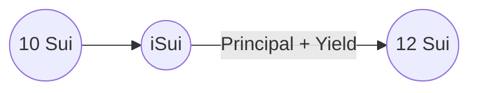
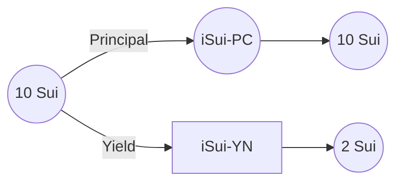

# [IPX Liquid Staking Derivative](https://www.interestprotocol.com/)

<p>  </p>

## Quick start

Make sure you have the latest version of the Sui binaries installed on your machine

[Instructions here](https://docs.sui.io/devnet/build/install)

### Run tests

**To run the tests**

```bash

sui  move  test

```

### Publish

```bash

sui  client  publish  --gas-budget  500000000

```

### Functionality

Interest Liquid Staking Derivative allows users to stake and unstake Sui in their validator of choice. Users have two Mint options:

**First Option**



- iSui (Interest Sui): It tracks the pool's principal and rewards. Therefore, its value is always higher than Sui.

**Second Option**



- iSui-PC (Interest Sui Principal Coin): It tracks the principal portion of a stake. This coin is always equal to Sui.

- iSui-YN (Interest Sui Yield NFT): It tracks the rewards portion of a stake. This NFT Sui value grows over time.

> Selling any of these assets, means selling the entire position. They
> do not require any other object to mint/burn and are the module does not keep track of addresses. Therefore, they are
> composable with DeFi.

## Core Values

- **Decentralized:** Users can deposit/withdraw from any validator

- **Non-custodial:** The admin does not have any access to the funds. It uses a Coin accounting system to keep track of deposits/rewards

- **Fair:** The deposit fee increases as a validator gets a higher stake compared to others. It incentivizes users to deposit in other validators.

- **Flexible:** Users have granular control over their deposit via the 3 Coin options.

## Repo Structure

- **pool.move:** It mints/burns the LSD Coins

- **admin.move:** It contains the logic to manage the AdminCap

- **test:** It contains all tests for these packages

- **lib:** It contains utility modules to support the {pool.move} module

- **coins:** It contains the Coins that {pool.move} mint and burn

## Technical Overview

The Interest LSD portfolio is managed by the **Rebase struct**. It is stored in the **PoolStorage** shared object under **pool**.

- **base** It represents the shares of the portfolio (iSui)
- **elastic** It represents the assets held by the portfolio (Sui)

> Interest LSD Portfolio:
> Base: 1000
> Elastic: 1200
>
> 10 iSui is worth 12 Sui - *10 * 1200 / 1000*
> The exchange rate iSui ==> SUI is 1.2
>
> 10 Sui is worth ~8.3 iSui - *10 * 1000 / 1200*

## Contact Us

- X: [@interest_dinero](https://x.com/interest_dinero)

- Discord: https://discord.gg/interestprotocol

- Telegram: https://t.me/interestprotocol

- Email: [contact@interestprotocol.com](mailto:contact@interestprotocol.com)

- Medium: [@interestprotocol](https://medium.com/@interestprotocol)
