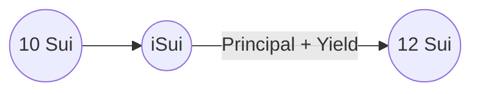
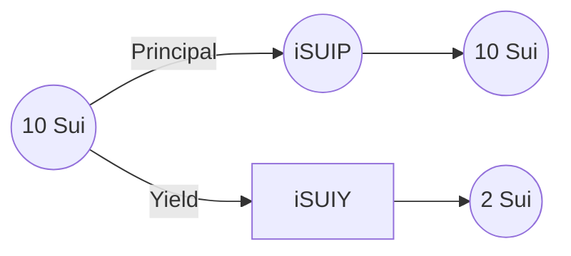
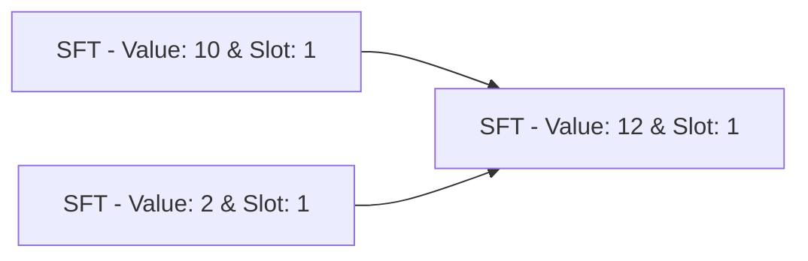
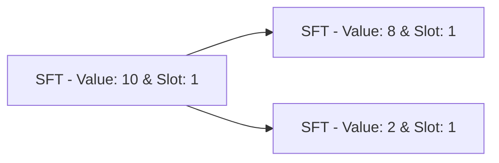
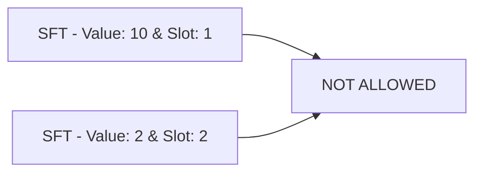

# [Interest LST](https://www.interestprotocol.com/)

<p>  </p>

## Quick start

Make sure you have the latest version of the Sui binaries installed on your machine

[Instructions here](https://docs.sui.io/devnet/build/install)

### Run tests

**To run the tests**

```bash
cd lst
sui move test --skip-fetch-latest-git-deps
```

### Publish

```bash
sui  client  publish  --gas-budget  500000000 --skip-fetch-latest-git-deps
```

### Dependencies

Interest LST depends on the following packages

- [MoveStdlib](https://github.com/MystenLabs/sui/tree/main/crates/sui-framework/packages/move-stdlib) - Standard Move library
- [Sui](https://github.com/MystenLabs/sui/tree/main/crates/sui-framework/packages/sui-framework) - Sui Move Library
- [SuiSystem](https://github.com/MystenLabs/sui/tree/main/crates/sui-framework/packages/sui-system) - Sui System modules
- [SuiTears💧](https://github.com/interest-protocol/suitears) : Library of production ready Sui Move modules

### Functionality

Interest Liquid Staking Tokens allows users to stake and unstake Sui in their validator of choice. Users have two Mint options:

**First Option**



- iSui (Interest Sui): It tracks the pool's principal and rewards. Therefore, its value is always higher than Sui.

**Second Option**



- iSUIP (Interest Sui Principal): It tracks the principal of a Native Staked Sui Object. This coin is always equal to Sui.
- iSUIY (Interest Sui Yield): It is a fungible yield bearing asset that tracks the yield portion of a Native Staked Sui Object.

> Selling any of these assets, means selling the entire position. They do not require any other object to mint/burn and the module does not keep track of addresses. Therefore, they are composable with DeFi.

## Core Values

- **Decentralized:** Users can deposit/withdraw from any validator
- **Non-custodial:** The admin does not have any access to the funds. It uses a Coin + SFT accounting system to keep track of deposits/rewards
- **Fair:** The deposit fee increases as a validator gets a higher stake compared to others. It incentivizes users to deposit in other validators.
- **Flexible:** Users have granular control over their deposit via the 3 Asset options.

## Repo Structure

This module is structured to be easily upgraded to support Sui's latest Staking modules.

- **lst:** The Interest LST modules
  - **assets** Assets minted by the protocol
    - **isui.move**: The Interest Sui Module
    - **isui_principal.move**: The Interest Principal Module
    - **isui_yield.move**: The Interest Yield Module
  - **core:** The core LST modules
    - **events.move**: It emits the LST events
    - **lst.move**: The public functions to interact with LST
    - **lst_inner_state.move**: It handles LST state and mutations
    - **validator.move**: It manages the Validator State
  - **lib:** Set of utility modules
    - **assets_utils.move**: Utility to transfer assets
    - **fee_utils.move**: Handles fee calculations
    - **staking_pool_utils.move**: Calculates the rewards in a StakingPool
    - **unstake_algorithms.move**: Handles the logic to unstake Sui
  - **test:** Handles test files
    - **lst_tests.move**: Tests for lst.move
    - **test_utils.move**: Testing utility functions
  - **admin.move:** Creates the LstAdmin struct
  - **constant.move:** Stores protocol constants
    - **entry.move:** entry functions for lst.move
    - **errors.move:** Store errors constants
    - **query.move:** Utility functions to query data from Interest LST
- **yield:** The Interest LST modules
  - **yield.move:** SFT wrapper to track of the yield of Interest Bearing Tokens

## Portfolio Logic

The Interest LST portfolio is managed by the **Fund struct**. It is stored in the **StateV1** shared object under **pool**.

- **shares** It represents the shares of the portfolio (iSui)
- **underlying** It represents the assets held by the portfolio (Sui)
  
> Interest LST Portfolio:
> 
> Shares: 1000
> 
> Underlying: 1200
> 
> 10 iSui is worth 12 Sui - _10 \* 1200 / 1000_
> 
> 10 Sui is worth ~8.3 iSui - _10 \* 1000 / 1200_

## SFT (Semi Fungible Tokens)

```move
struct SftBalance<phantom T> has store {
    slot: u256, // Provides fungibility between the NFTs
    value: u64
}

struct SemiFungibleToken<phantom T> has key, store {
  id: UID, 
  balance: SftBalance<T>
}
```

Semi-fungible tokens can exchange value if they have the same slot as a coin. SFTs with the same slot can be joined together or split apart. iSUIP and iSUIY are SFTs. Their maturity is saved in the slot attribute.

### Fungible with the same slot

**Join**



**Split**



### Non-Fungible different slots

**Join**



## Authors

- [JMVC](https://twitter.com/josemvcerqueira)
- [Thouny](https://twitter.com/BL0CKRUNNER)

## Contact Us

- X: [@interest_dinero](https://x.com/interest_dinero)
- Discord: https://discord.gg/interestprotocol
- Telegram: https://t.me/interestprotocol
- Email: [contact@interestprotocol.com](mailto:contact@interestprotocol.com)
- Medium: [@interestprotocol](https://medium.com/@interestprotocol)
