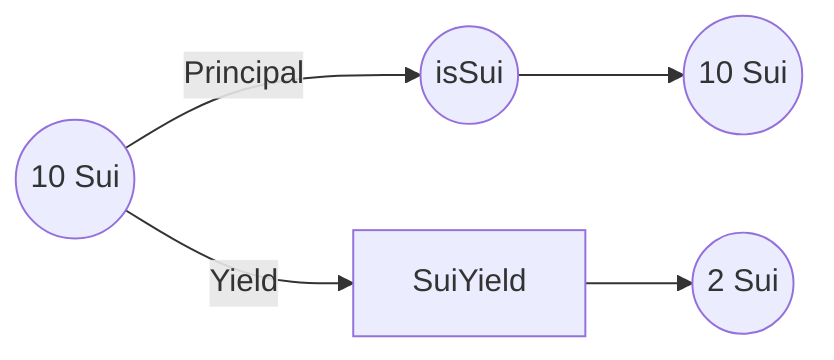
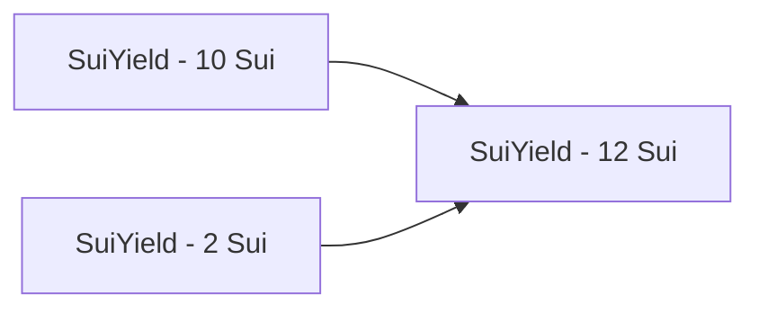
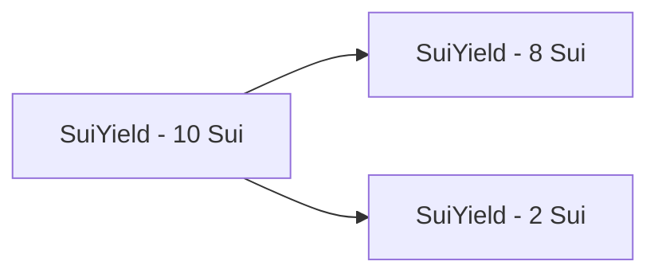

# [IPX Liquid Staking Derivative](https://www.interestprotocol.com/)

<p>  </p>

## Quick start

Make sure you have the latest version of the Sui binaries installed on your machine

[Instructions here](https://docs.sui.io/devnet/build/install)

### Run tests

**To run the tests**

```bash

sui  move  test

```

### Publish

```bash

sui  client  publish  --gas-budget  500000000

```

### Functionality

Interest Liquid Staking Derivative allows users to stake and unstake Sui in their validator of choice. Users have two Mint options:

**First Option**


- iSui (Interest Sui): It tracks the pool's principal and rewards. Therefore, its value is always higher than Sui.

**Second Option**



- isSUI (Interest Staked Sui Coin): It tracks the principal of a Native Staked Sui Object. This coin is always equal to Sui.

- SuiYield: It is a fungible yield bearing asset that tracks the yield portion of a Native Staked Sui Object.

> Selling any of these assets, means selling the entire position. They
> do not require any other object to mint/burn and are the module does not keep track of addresses. Therefore, they are
> composable with DeFi.

## Core Values

- **Decentralized:** Users can deposit/withdraw from any validator

- **Non-custodial:** The admin does not have any access to the funds. It uses a Coin + NFT accounting system to keep track of deposits/rewards

- **Fair:** The deposit fee increases as a validator gets a higher stake compared to others. It incentivizes users to deposit in other validators.

- **Flexible:** Users have granular control over their deposit via the 3 Asset options.

## Repo Structure

- **pool.move:** It mints/burns the LSD Assets

- **admin.move:** It contains the logic to manage the AdminCap

- **test:** It contains all tests for these packages

- **lib:** It contains utility modules to support the {pool.move} module

- **coins:** It contains the Coins that {pool.move} mint and burn

## Portfolio Logic

The Interest LSD portfolio is managed by the **Rebase struct**. It is stored in the **PoolStorage** shared object under **pool**.

- **base** It represents the shares of the portfolio (iSui)
- **elastic** It represents the assets held by the portfolio (Sui)

> Interest LSD Portfolio:
> Base: 1000
> Elastic: 1200
>
> 10 iSui is worth 12 Sui - _10 \* 1200 / 1000_
>
> 10 Sui is worth ~8.3 iSui - _10 \* 1000 / 1200_

## Sui Yield

```move

  struct SuiYield has key, store {
    id: UID,
    principal: u64,
    shares: u64,
    is_clean: bool
  }

```

The SuiYield is a fungible asset. It can be redeemed to Sui, therefore, it can be merged and split. We can easily build an AMM by merging all SuiYield into one and relying on the function join and split for all other operations:

Join:

- Swap in SuiYield for WETH
- Add Liquidity

Split:

- Swap WETH for SuiYield
- Remove Liquidity

**Join**



**Split**



## Authors

- [JMVC](https://twitter.com/josemvcerqueira)
- [Thouny](https://twitter.com/BL0CKRUNNER)

## Contact Us

- X: [@interest_dinero](https://x.com/interest_dinero)

- Discord: https://discord.gg/interestprotocol

- Telegram: https://t.me/interestprotocol

- Email: [contact@interestprotocol.com](mailto:contact@interestprotocol.com)

- Medium: [@interestprotocol](https://medium.com/@interestprotocol)
